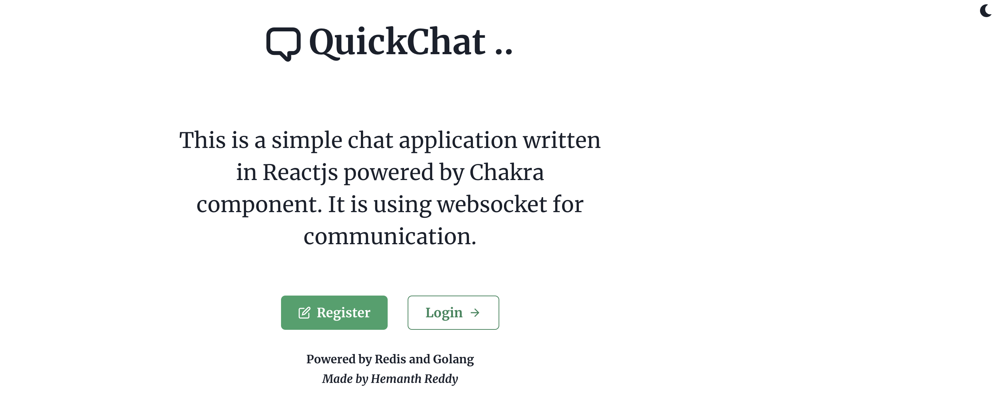

# QuickChat — Instant Messaging Platform

A real-time chat platform built with a Go backend and React frontend. Multiple server instances stay in sync via **Redis Pub/Sub** — any message published to one instance is fanned out to all subscribers across the cluster. Message history is served from Redis cache for fast reads without hitting the database on every load.



## Architecture

```
 ┌────────────┐  WebSocket   ┌──────────────────┐
 │  Browser A │ ───────────► │  Go WS server :8081│
 └────────────┘              │                  │
                             │  pub/sub channel  ├──► Redis Pub/Sub ◄──┐
 ┌────────────┐  WebSocket   │                  │                      │
 │  Browser B │ ───────────► │  Go WS server :8081│ (scale horizontally) │
 └────────────┘              └──────────────────┘                      │
                                       ▲                               │
 ┌────────────┐  REST :8080  ┌──────────────────┐                      │
 │  Browser   │ ───────────► │  Go HTTP server  │──────────────────────┘
 │ (history)  │ ◄─────────── │  (messages, users)│  Redis cache (history)
 └────────────┘              └──────────────────┘
```

**Why Redis Pub/Sub?**
With a single WebSocket server, every connected client shares memory — easy. With multiple instances, you need a message bus so that a message delivered to server A reaches clients connected to server B. Redis Pub/Sub is the fanout layer; each server subscribes to the channel and broadcasts to its local clients.

## Tech stack

| Layer | Technology |
|---|---|
| Backend HTTP | Go · Gorilla Mux |
| Backend WebSocket | Go · Gorilla WebSocket |
| Message fanout | Redis Pub/Sub |
| History cache | Redis (list / sorted set) |
| Frontend | React |
| CORS | rs/cors |

## Local setup

**Prerequisites:** Go 1.17+, Node.js 16+, Redis running on `localhost:6379`

```bash
git clone https://github.com/S-HEMANTH-REDDY/Quick_Chat.git
cd Quick_Chat
```

Copy the example env file and configure:
```bash
cp .env.example .env   # set REDIS_ADDR if not localhost:6379
```

Install Go dependencies:
```bash
go mod tidy
```

Install frontend dependencies:
```bash
cd client && npm install && cd ..
```

**Run (3 terminals):**

```bash
# Terminal 1 — HTTP API server
go run main.go --server=http

# Terminal 2 — WebSocket server
go run main.go --server=websocket

# Terminal 3 — React frontend
cd client && npm start
```

App is live at **http://localhost:3000**

## Key design decisions

**Thread-safe hub:** The WebSocket hub manages client registration and broadcast in a single goroutine with a `select` loop — no mutex needed for the client map.

**Redis Pub/Sub fanout:** Each WS server instance subscribes to a shared channel. On message receipt, it publishes to Redis; the subscription goroutine fans the message out to all local clients.

**History on connect:** When a client connects, recent messages are fetched from a Redis list (O(1) range read), not the database — keeping connection setup fast under concurrent load.
